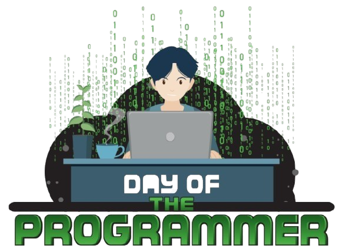
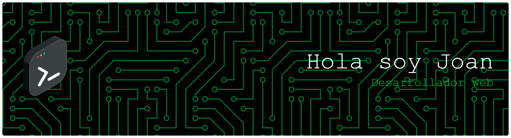

#  Bienvenid@ al GitHub de Joan Pedraza

Desarrollador apasionado por la **tecnología** y la **programación**, actualmente creando soluciones digitales desde **Bilbao, España**. 🚀

### 📈 Mis Objetivos
- 💻 Construir aplicaciones útiles y escalables.
- 🎓 Aprender algo nuevo cada día para mejorar mi stack técnico.
- 🤝 Colaborar en proyectos de código abierto.

## 🛠️ Tecnologías

---
📫 **¿Cómo contactarme?**
* **LinkedIn:** [@rcomina](https://www.linkedin.com/in/rcomina/)
* **Email:** [racominach@outlook.es](#  Bienvenid@ al GitHub de Alejandro Cómina

Desarrollador apasionado por la **tecnología** y la **programación**, actualmente creando soluciones digitales desde **Bilbao, España**. 🚀

### 📈 Mis Objetivos
- 💻 Construir aplicaciones útiles y escalables.
- 🎓 Aprender algo nuevo cada día para mejorar mi stack técnico.
- 🤝 Colaborar en proyectos de código abierto.

## 🛠️ Tecnologías

---
📫 **¿Cómo contactarme?**
* **LinkedIn:** [@rcomina](https://www.linkedin.com/in/rcomina/)
* **Email:** [ca754029@gmail.com](ca754029@gmail.com)
* **WhatsApp:** [+34 602531818](+34 603244621)